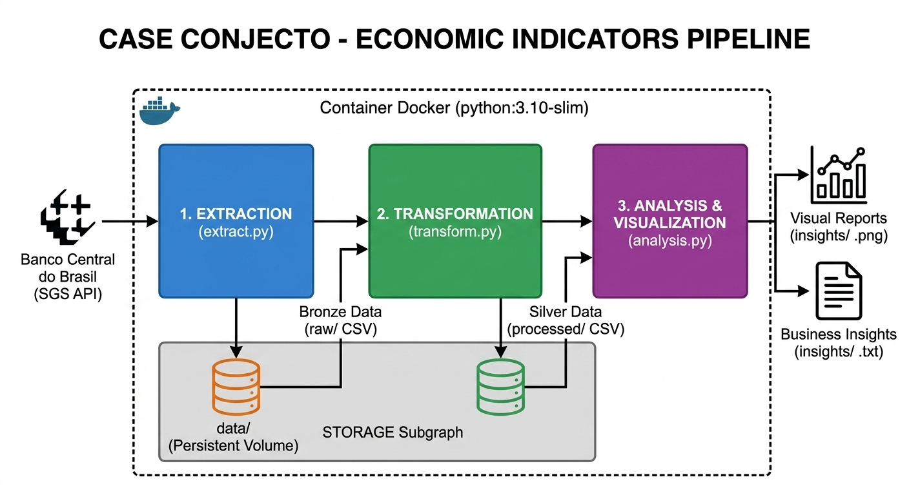

# Case Conjecto - Pipeline de Indicadores Econômicos 📈

Este projeto consiste em uma Pipeline de Dados automatizada que extrai, transforma e analisa indicadores econômicos cruciais *(Dólar, Selic e Inflação)* diretamente da API pública do Banco Central do Brasil *(SGS - Sistema Gerenciador de Séries Temporais)*.

O objetivo é fornecer uma visão clara e analitica da relação entre política monetária, câmbio e custo de vida no cenário de 2026.


## 📖 Guia de Navegação
Os arquivos de evidência deste desafio foram centralizados na pasta */evidencias*. Para entender a metodologia aplicada e as instruções de execução, consulte o respectivo *README.md*.

* [**README.md**](./evidencias/README.md)


## 🏗️ Estrutura do Projeto

A solução foi desenhada seguindo os princípios de modularização e separação de responsabilidades:



### Estrutura de diretório

```text
CASE_CONJECTO/
├── data/                  # Armazenamento de dados (Persistência)
│   ├── insights/          # Gráficos (PNG) e relatórios de texto (TXT)
│   ├── processed/         # Dados limpos e transformados (Camada Silver)
│   └── raw/               # Dados brutos extraídos da API (Camada Bronze)
├── logs/                  # Registros de execução da pipeline
├── src/                   # Código fonte modularizado
│   ├── __init__.py
│   ├── extract.py         # Lógica de consumo da API do BCB
│   ├── transform.py       # Limpeza e cálculos estatísticos
│   └── analysis.py        # Geração de visualizações e insights
├── Dockerfile             # Configuração da imagem Docker
├── main.py                # Ponto de entrada (Orquestrador da Pipeline)
├── requeriments.txt       # Dependências do projeto
└── README.md              # Documentação principal
```

## 🚀 Como Executar

A pipeline foi totalmente "dockerizada" para garantir que rode em qualquer ambiente sem necessidade de instalar dependências localmente.

**1. Clonar o Repositório**

```
git clone https://github.com/arthurrats/Case-Conjecto.git
```

```
cd case_conjecto
```

**2. Pré-requisitos**


* Docker Desktop **instalado** e em **execução**.

* (**Para usuários Windows**): Certifique-se de que o Docker esteja iniciado (*ícone da baleia verde*).


**3. Construir a Imagem**

No terminal, dentro da pasta do projeto, execute:

```text
docker build -t case_conjecto .
```

**4. Rodar a Pipeline**

Para que os gráficos e logs gerados dentro do Docker apareçam na sua máquina host, utilize o mapeamento de volumes:

* No Windows (Prompt de Comando / CMD):

```
docker run -v "%cd%/data:/app/data" -v "%cd%/logs:/app/logs" case_conjecto
```

* No Linux ou macOS (Terminal):

```
docker run -v $(pwd)/data:/app/data -v $(pwd)/logs:/app/logs case_conjecto
```

## 📁 Exploração dos Resultados

Após o término da execução, os artefatos estarão disponíveis localmente:

* **Gráficos Analíticos:** Veja em `data/insights/*.png` para análises visuais de tendência.
* **Relatórios Executivos:** Confira `data/insights/*.txt` para um resumo técnico da volatilidade e correlação.
* **Base de Dados (Silver):** Acesse `data/processed/*.csv` para os dados limpos e prontos para modelagem.
* **Monitoramento:** Verifique `logs/pipeline.log` para conferir o sucesso de cada etapa da execução.

## 🛠️ Tecnologias Utilizadas

**Python 3.10**: Linguagem base.

**Pandas**: Manipulação e tratamento de dados.

**Requests**: Consumo de API REST.

**Matplotlib** & **Seaborn**: Geração de gráficos.

**Docker**: Conteinerização da aplicação.
