# Desafio
## Descrição da Solução e Decisões Técnicas

A solução foca na criação de um fluxo de dados resiliente, modular e documentado, cobrindo todo o ciclo de vida do dado.

#### O que foi feito e por quê?

* **Coleta via API Pública (SGS/BCB)**: Selecionei a API do Banco Central do Brasil por ser uma fonte oficial de dados econômicos. O consumo foi feito via script Python com tratamento de erros para falhas de requisição e timeouts.

* **Armazenamento e Estrutura de Pastas**: Os dados são persistidos em formato CSV, organizados em uma estrutura de camadas (raw, processed, insights). Isso garante a rastreabilidade e segue as boas práticas de organização de projetos de dados.

* **Tratamento de Dados com Pandas**: Realizei a limpeza de valores nulos, remoção de duplicatas e padronização de formatos de data e moeda. Também criei novas métricas, como a variação percentual diária e picos de volatilidade.

* **Análise e Visualização**: Foram geradas 3 análises: correlação Selic/Dólar, comportamento da inflação (IPCA) e estatísticas descritivas (médias, máximos e mínimos). As visualizações foram feitas com Matplotlib para facilitar a interpretação.

* **Containerização com Docker**: Implementei a "dockerização" do projeto como um diferencial técnico, garantindo que a pipeline seja executável em qualquer sistema operacional (Windows/Linux) sem conflitos de dependências.

#### Justificativa de Arquitetura: Por que não usar Banco de Dados?

Embora o desafio permitisse o uso de bancos de dados como PostgreSQL ou SQLite, optei conscientemente pelo armazenamento em arquivos estruturados (CSV) pelos seguintes motivos:

* **Volume de Dados**: Como o volume de registros extraído para este cenário de teste é reduzido, o uso de um banco de dados adicionaria uma complexidade desnecessária à infraestrutura.

* **Simplicidade e Portabilidade**: O uso de CSVs facilita a execução imediata, sem a necessidade de configurar servidores ou serviços externos, priorizando uma solução funcional e organizada.

#### O Desafio foi dividido em etapas para a melhor compreensão do leitor.

## Etapas
A seguir estará o passo a passo de como foi realizado o processo de busca de API's públicas até a construção de gráficos com os dados coletados. Haverá trechos de código e evidências fotográficas para a melhor compreensão do leitor.

## Preparação para o desafio:
Vamos construir o nosso desafio seguindo o passo a passo desta Pipeline.


Para construir este desafio, vamos utilizar a ferramenta [Visual Studio Code](https://code.visualstudio.com/) para criar a estrutura do projeto.

Completando a estrutura de diretório, vamos procurar uma **API** pública para as nossas requisições.

### API selecionada
* Acessando o link https://www3.bcb.gov.br/sgspub/, temos acesso ao site onde vamos extrair nossas informações:

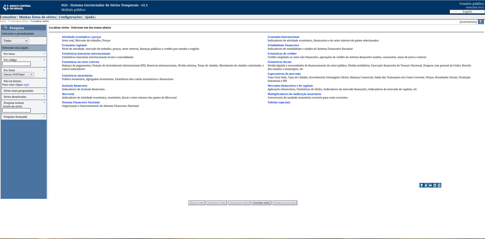

* Nós iremos extrair três tipos de dados desse site:
    * **Dólar** (10813)
    * **Taxa Selix** (11)
    * **Inflação** (433)

Confirmando os nossos dados, vamos em começar o processo de **ETL**.

## Etapa 1: criação do script de extração

* Vamos criar um script em python para fazer toda a extração dos dados da API selecionada.

```python
# === CÓDIGO PARA A EXTRAÇÃO DE DADOS VIA API: BCB - (SGS) ===

# Importa bibliotecas necessárias.
import requests
import pandas as pd
import os
import logging
from datetime import datetime, timedelta

# Handle de arquivo: salva um arquivo INFO de extração na pasta 'logs'.
logging.basicConfig(
    filename='logs/pipeline.log',
    level=logging.INFO,
    format='%(asctime)s - %(levelname)s - %(message)s'
)

# Função: extrai dados do bcb (Banco Central).
def extracao_dados(codigo, nome_arquivo):
    """Consome a API do Banco Central (SGS) com tratamentos de erros."""

    # Definindo o período: 01/01/2026 até 3 dias atrás (D-3).
    data_inicio = "01/01/2026"
    data_fim = (datetime.now() - timedelta(days=3)).strftime('%d/%m/%Y') 

    # URL da API.
    url = f"https://api.bcb.gov.br/dados/serie/bcdata.sgs.{codigo}/dados?formato=json&dataInicial={data_inicio}&dataFinal={data_fim}"

    # Tratando erros.
    try: 
        logging.info(f"Iniciando a extração da série {codigo} - ({nome_arquivo})")

        # Limita a requisição em 15 segundos.
        response = requests.get(url, timeout=15)

        # Verifica se o retorno da API é 200.
        response.raise_for_status()

        # Convertendo os dados para o formato (.json).
        dados = response.json()

        # Tratando erro de dados nulos.
        if not dados:
            logging.warning(f"A série {codigo} retornou vazia.")
            return False
        
        # Converte os dados em DataFrame e envia para a pasta 'data/raw'
        df = pd.DataFrame(dados)
        caminho_final = os.path.join("data", "raw", f"{nome_arquivo}.csv")
        df.to_csv(caminho_final, index=False)

        # Mensagem de sucesso.
        logging.info(f"Sucesso: {len(df)} registros salvos em {caminho_final}.")
        return True
    
    # Tratando erros de séries (dados).
    except requests.exceptions.RequestException as e:
        logging.error(f"Erro de conexão na série {codigo}: {e}.")
        return False
    except Exception as e:
        logging.error(f"Erro inesperado na série {codigo}: {e}.")
        return False
```

* Dentro do nosso script **extract.py**, há uma implementação de rastreamento de logs com tratamento de erros. Essa função permite o acompanhamento em tempo real de cada execução. 

### Execução da etapa 1:

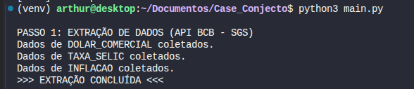

### Arquivos gerados na etapa 1:

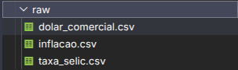

## Etapa 2: criação do script de transformação

```python
# === CÓDIGO PARA A TRANSFORMAÇÃO DE DADOS ===

# Importa bibliotecas necessárias.
import pandas as pd
import os
import logging

# Função: transforma dados já extraídos.
def transformacao_dados(nome_arquivo):
    """Lê o dado bruto da pasta data/raw e faz transformações com métricas iniciais."""
    caminho_entrada = os.path.join("data", "raw", f"{nome_arquivo}.csv")
    caminho_saida = os.path.join("data", "processed", f"{nome_arquivo}_clean.csv")

    # Tratando erros.
    try:
        logging.info(f"--- INICIANDO A TRANSFORMAÇÃO: {nome_arquivo} ---")

        # Carregando o csv bruto.
        df = pd.read_csv(caminho_entrada)

        # Tratamento 1: tratando Datas.
        df['data'] = pd.to_datetime(df['data'], dayfirst=True)

        # Tratamento 2: tratando números (5,10 --> 5.10).
        if df['valor'].dtype == 'O':
            df['valor'] = df['valor'].str.replace(",", ".").astype(float)

        # Tratamento 3: tratando as duplicidades.
        df = df.dropna().drop_duplicates().sort_values('data')

        # Métrica 1: calculando a variação do percentual diário/mensal.
        df['variavao_percentual'] = df['valor'].pct_change() * 100

        # Métrica 2: calculando picos de volatilidade.
        df['pico_volatilidade'] = df['variavao_percentual'].apply(lambda x: True if abs(x) > 1.0 else False)

        # Tratando erro: garate que a pasta de destino exista.
        os.makedirs("data/processed", exist_ok=True)

        # Salva os dados limpos (Camada Silver)
        df.to_csv(caminho_saida, index=False)

        # Mensagem de sucesso após a execução correta.
        logging.info(f"Sucesso: o {nome_arquivo} foi salvo com sucesso em {caminho_saida}.")
        return True
    
    # Tratando exceções.
    except Exception as e:
        logging.error(f"Erro: falha no processo de transformação de {nome_arquivo}: {e}")
        return False
```

### Execução da etapa 2:

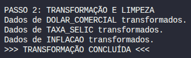

### Arquivos gerados na etapa 2:

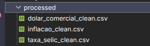

## Etapa 3: criação do script principal (main)

* Com a extração e transformação implementada, podemos criar um main executável, onde teremos acesso a extração dos dados via API e sua respectiva transformação.

* Também será possível acompanhar, em tempo real, todos os logs que foram gerados pela execução.

* **Código main:**

```python
# === CÓDIGO PARA A EXECUÇÃO DA NOSSA EXTRAÇÃO ===

# Importando bibliotecas necessárias.
from src.extract import extracao_dados
from src.transform import transformacao_dados
from src.analysis import analise_dado
import os

# Execução: executando a nossa extração.
def run_pipeline():
    # Dicionário com as séries.
    series = {
        10813 : "dolar_comercial",
        11 : "taxa_selic",
        433 : "inflacao"
    }

    # ETAPA 1: EXTRAÇÃO (Camada Raw)
    print("\nPASSO 1: EXTRAÇÃO DE DADOS (API BCB - SGS)")

    for cod, nome in series.items():
        # Chama a função de extração.
        sucesso_ext = extracao_dados(cod, nome)
        
        if sucesso_ext:
            print(f"Dados de {nome.upper()} coletados.")
        else:
            print(f"Falha ao coletar {nome.upper()}. Verifique os logs.")

    print(">>> EXTRAÇÃO CONCLUÍDA <<<\n")

    # ETAPA 2: TRANSFORMAÇÃO (Camada Silver)
    print("PASSO 2: TRANSFORMAÇÃO E LIMPEZA")

    for nome in series.values():
        # Chama a função de transformação.
        sucesso_trans = transformacao_dados(nome)
        
        if sucesso_trans:
            print(f"Dados de {nome.upper()} transformados.")
        else:
            print(f"Falha ao transformar {nome.upper()}.")
    
    print(">>> TRANSFORMAÇÃO CONCLUÍDA <<<\n")

if __name__ == "__main__":
    run_pipeline()


# ETAPA 3: GERAÇÃO DE INSIGHTS.
print("PASSO 3: GERAÇÃO DE INSIGTHS")
analise_dado()

print("\n*** PIPELINE CONCLUÍDA COM SUCESSO ***\n")

```

* Após a implementação do script, vamos executar via terminal:

```text
python3 main.py
```

* ⚠️ **Nota para usuários Linux:**
Se encontrar um erro de **PermissionError** ao rodar o script localmente após ter usado o Docker, execute o comando abaixo para ajustar as permissões das pastas geradas pelo container:

```text
sudo chown -R $USER:$USER .
```

### Resultado da execução da etapa 3:

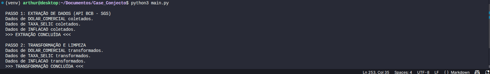

### Resultado dos logs após a execução da etapa 3:

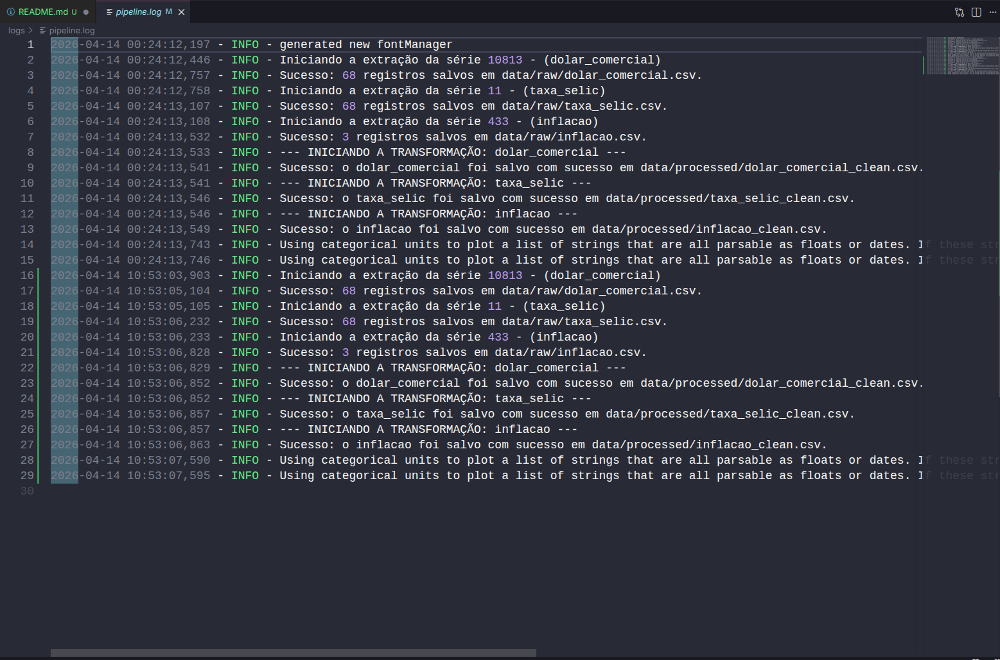

## Etapa 4: Definindo 3 análises para realizar nos arquivos .csv

**1ª análise:** Esta é a análise central do projeto. Investigamos como as decisões de política monetária (Selic) influenciam o valor da moeda estrangeira.

**2ª análise:** Nesta análise, focamos no índice oficial de inflação para entender o custo de vida.

**3ª análise:** Uma análise técnica voltada para a saúde dos dados e tendências gerais.

### Etapa 4.1: Criação do Script de análise

```python
# === CÓDIGO PARA A APRESENTAÇÃO DE DADOS ===

import pandas as pd
import matplotlib.pyplot as plt
import matplotlib.dates as mdates 
import seaborn as sns
import os

# Função: gera análises dos dados.
def analise_dado():
    # Carregando os dados processados.
    try:
        df_dolar = pd.read_csv("data/processed/dolar_comercial_clean.csv")
        df_selic = pd.read_csv("data/processed/taxa_selic_clean.csv")
        df_inflacao = pd.read_csv("data/processed/inflacao_clean.csv")

        # CONVERSÃO: garante o entendimento das datas.
        df_dolar['data'] = pd.to_datetime(df_dolar['data'])
        df_selic['data'] = pd.to_datetime(df_selic['data'])
        df_inflacao['data'] = pd.to_datetime(df_inflacao['data'])

        # Tratando erro: garante que a pasta de destino exista.
        os.makedirs("data/insights", exist_ok=True)
        sns.set_theme(style="whitegrid")

        # Gráfico 1: DÓLAR VS SELIC.
        fig, ax = plt.subplots(figsize=(12, 6))
        
        ax.plot(df_dolar['data'], df_dolar['valor'], label='Dólar (R$)', color='blue', linewidth=2)
        ax.plot(df_selic['data'], df_selic['valor'], label='Selic (%)', color='green', linestyle='--')

        # Alteração de datas: põe datas em momentos de pico
        ax.xaxis.set_major_locator(mdates.WeekdayLocator(interval=2)) 
        ax.xaxis.set_major_formatter(mdates.DateFormatter('%d/%m'))

        plt.title("Relação: Dólar vs Selic - Cenário 2026", fontsize=15)
        plt.xlabel('Período (Dia/Mês)')
        plt.ylabel('Valores')
        plt.legend()
        plt.xticks(rotation=0)

        # Salvando o gráfico de linhas.
        plt.tight_layout()
        plt.savefig("data/insights/relatorio_visual.png")
        plt.close()

        # Gráfico 2: inflação geral.
        plt.figure(figsize=(12, 6))
        
        # Exibir datas como 'Mês/Ano'.
        df_inflacao['mes_formatado'] = df_inflacao['data'].dt.strftime('%b/%y')
        
        sns.barplot(data=df_inflacao, x='mes_formatado', y='valor', color='red')
        plt.title("Variação Mensal: Inflação (IPCA) - 2026", fontsize=15)
        plt.xlabel('Mês')
        plt.ylabel('Variação (%)')

        # Salvando o gráfico de barras.
        plt.tight_layout()
        plt.savefig("data/insights/relatorio_inflacao.png")
        plt.close()

        # Confirmação dos arquivos salvos.
        print("Gráfico 'relatorio_visual.png' salvo em 'data/insights'.")
        print("Gráfico 'relatorio_inflacao.png' salvo em 'data/insights'.")

        # Cálculos para o relatório.
        ligacao = df_dolar['valor'].corr(df_selic['valor'])
        inflacao_total = df_inflacao['valor'].sum()

        # Variável que armazena o caminho.
        caminho = "data/insights/insights_negocio.txt"

        with open(caminho, 'w') as arquivo:
            arquivo.write("--- RELATÓRIO DE INSIGHTS ECONÔMICOS EM 2026 ---\n\n")
            arquivo.write(f"I. Correlação Dólar/selic: {ligacao:.2f}\n")
            arquivo.write("OBS.: Valores próximos de 1 indicam que a Selic subiu para acompanhar o Dólar.\n\n")
            
            arquivo.write("II. Volatilidade:\n")
            arquivo.write(f"O pico de variação do Dólar no período foi de {df_dolar['variavao_percentual'].max():.2f}%.\n\n")
            
            arquivo.write("III. Inflação Acumulada:\n")
            arquivo.write(f"A soma da variação do IPCA no período analisado foi de {inflacao_total:.2f}%.\n")

        print("Arquivo 'insights_negocio.txt' gerado com sucesso.")
        return True
    
    except Exception as e:
        print(f"Erro: falha na análise: {e}")
        return False
```

### Neste script foram criados **3 insights**: duas imagens **.png** e um arquivo **.txt**

* Relatório da inflação (**.png**)
* Relatório visual (**.png**)
* Relatório de tendências em formato (**.txt**)

### Relatório da inflação:

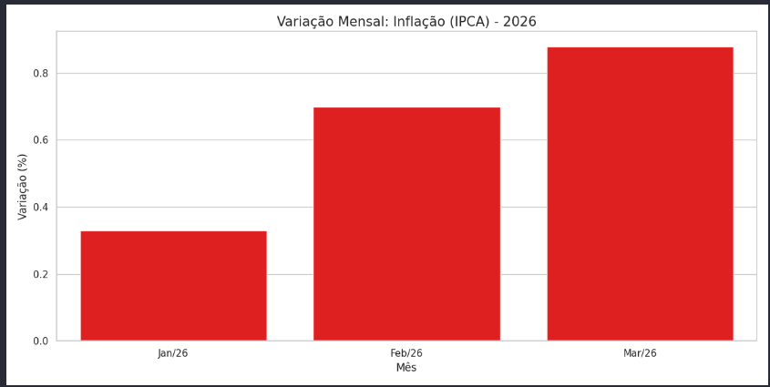

### Relatório da taxa Selic:

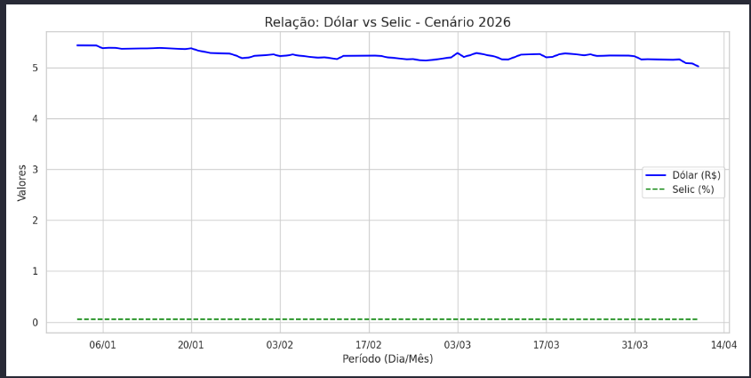

### Relatório de tendências:

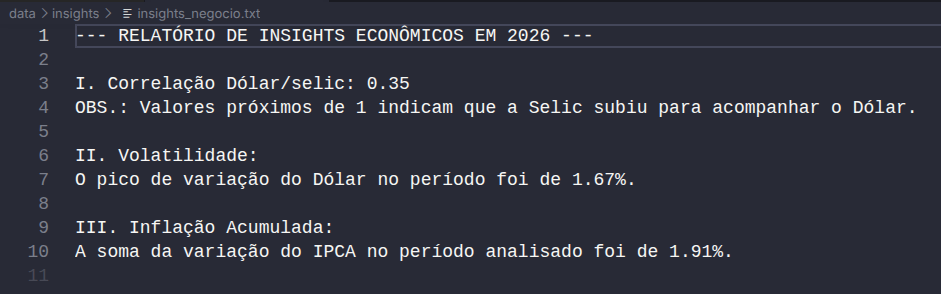

## Etapa 5: criação do docker

* Vamos "dockerizar" tudo para que qualquer máquina possa acessar o projeto sem baixar os componentes.

### Etapa 5.1: criação do script Dockerfile

```python
# Imagem do python
FROM python:3.10-slim
# Diretório dentro do Docker
WORKDIR /app
# Copia o arquivo de depenência
COPY requeriments.txt .
# Instala as dependências
RUN pip install --no-cache-dir -r requeriments.txt
# Copia todo o conteúdo do projeto para o container
COPY . .
# Cria as pastas necessárias
RUN mkdir -p data/raw data/processed data/insights logs
# Comando para rodar a Pipieline
CMD ["python", "main.py"]
```

* Após a criação do docker, vamos criar a imagem no terminal.

```text
docker build -t case_conjecto .
```

* Criando a imagem no docker.

* No **Windows** (Prompt de Comando / CMD):

```text
docker run -v "%cd%/data:/app/data" -v "%cd%/logs:/app/logs" case_conjecto
```

* No **Linux** ou **macOS** (Terminal):

```text
docker run -v $(pwd)/data:/app/data -v $(pwd)/logs:/app/logs case_conjecto
```

#### Execução da etapa 5.1 completa:

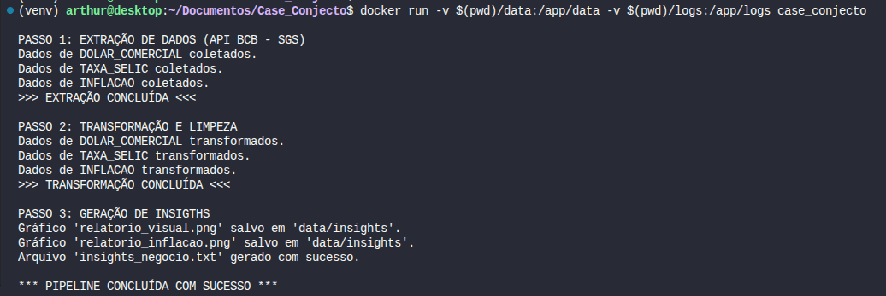

# Fim do código.